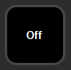
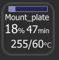
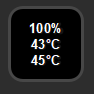

# StreamDeck Plugin for OctoPrint (fixed 2.0)

shows your 3D-Printer completion state in percent on your StreamDeck ([OctoPrint](https://github.com/OctoPrint/OctoPrint) required)

This plugin is based on https://github.com/cpeuschel/streamdeck-octodeck plugin but with new features, tweaks and bug fixes.

## Changes compared to original repository:
- **New feature**: Temperatures are shown on buttons.
- **New feature**: Added 10 second option as I felt 30sec wasn't fast enough.
- **Bug fixed**: Now supports multible instances of the tile if you are controlling multible octoprints.
- **Bug fixed**: Buttons information didn't always update. Fixed it and now they should always update when visible on Stream Deck.

## Examples how it looks

| Printer is offline  | Printer is preheated,   not printing yet. | Printer is printing. | Print done. |
| ------------- | ------------- | ------------- | ------------- | 
|   |   |  |  |

## Installation
Download the latest release. Double click on the file `com.cpeuschel.octodeck.streamDeckPlugin` to install.

## Configuration (Saved automatically)
1. Choose your favourite color and font (see example)
   
   
2. Add your OctoPrint Url e.g `http://192.168.178.13`
3. Add your API-Key [click](https://docs.octoprint.org/en/master/api/general.html#authorization)
4. Choose your update interval
5. Choose your favourite background color

    

## Use
Click the icon on your StreamDeck to update the completion. Automatic update time which you are using in the configuration

## Available States
- `On` => the printer is connected and is ready to print
- `Off` => the printer is not connected with OctoPrint
- `Cancel` => print is canceling
- `20 %, 210°C, 50°C` Completion in percent, hotend temperature and bed temperature.
