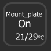

# Graphical StreamDeck Plugin for OctoPrint

Shows your 3D-Printer state, progress and temperatures on your StreamDeck ([OctoPrint](https://github.com/OctoPrint/OctoPrint) required)

This plugin is based on https://github.com/cpeuschel/streamdeck-octodeck plugin but has been basically rewritten to support graphical elements, new features, and several bugs fixed.

## Changes compared to original repository:
- **New feature**: "Heating/Cooling" text shown when printer is heating up or cooling down. Also up/down arrow is shown next to temperatures to indicate this.
- **New feature**: All elements are now graphical meaning that different text sizes and colors could be used when displaying the status.
- **New feature**: Printed filename shown
- **New feature**: Temperatures are shown on button(s).
- **New feature**: Added 10 second option as I felt 30sec wasn't fast enough.
- **Bug fixed**: Now supports multible instances of the tile if you are controlling multible octoprints.
- **Bug fixed**: Buttons information didn't always update. Fixed it and now they should always update when visible on Stream Deck.

## Examples how it looks

  Printer is offline
 
  Printer is on. Selected filename shown in top row.
 
  Printer is heating
 
  Starting to print.  
 Progress % and remaining print time shown. (Heating up symbol shown as the print is just starting up.)
 
  Printer is printing.  
 Progress bar shown on top. Progress % and remaining print time shown.
 
  Print has been cancelled.
 
  Printer is cooling down.
  
## Installation
Download the latest release. Double click on the file `com.cpeuschel.octodeck.streamDeckPlugin` to install.

## Configuration (Saved automatically)
1. Add your OctoPrint Url e.g `http://192.168.178.13`
2. Add your API-Key [click](https://docs.octoprint.org/en/master/api/general.html#authorization)
3. Choose your update interval
4. Choose your favourite background color

    
